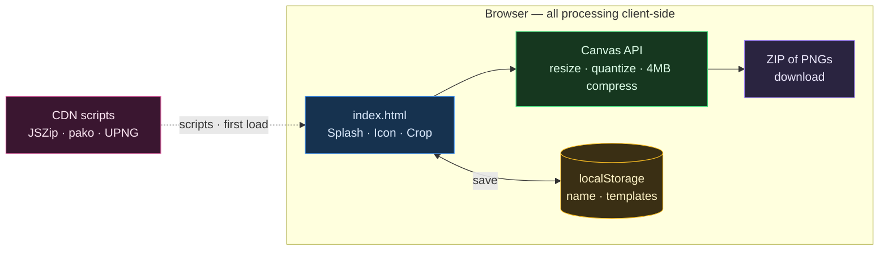

# Architecture: Course App Resizer — System Overview

> **TL;DR:** Single-file browser tool. Resizes + renames golf-course app images entirely client-side via the Canvas API. Only external touch is three CDN libraries on first load.

## The shape

## Scope & surface
- **Trust boundary:** the browser tab. Images never leave it; no backend, no upload.
- Only egress is fetching **JSZip / pako / UPNG.js** from a CDN on first load (needs network once).
- Persistence is `localStorage` (`cai_courseName`, `cai_templates`) — per-browser, per-origin.

## Invariants
- Single self-contained `index.html`; the `design_handoff/` copy is byte-identical reference — edit the root file only.
- Exported filenames always run through `getSafeCourseName()`; keep the 4MB compression pipeline in the export path.

## Where things live
See `CLAUDE.md` (L0 map) — logic is indexed by function name inside the one `<script>` block.

## Related
- [[00-Index/Home]]
